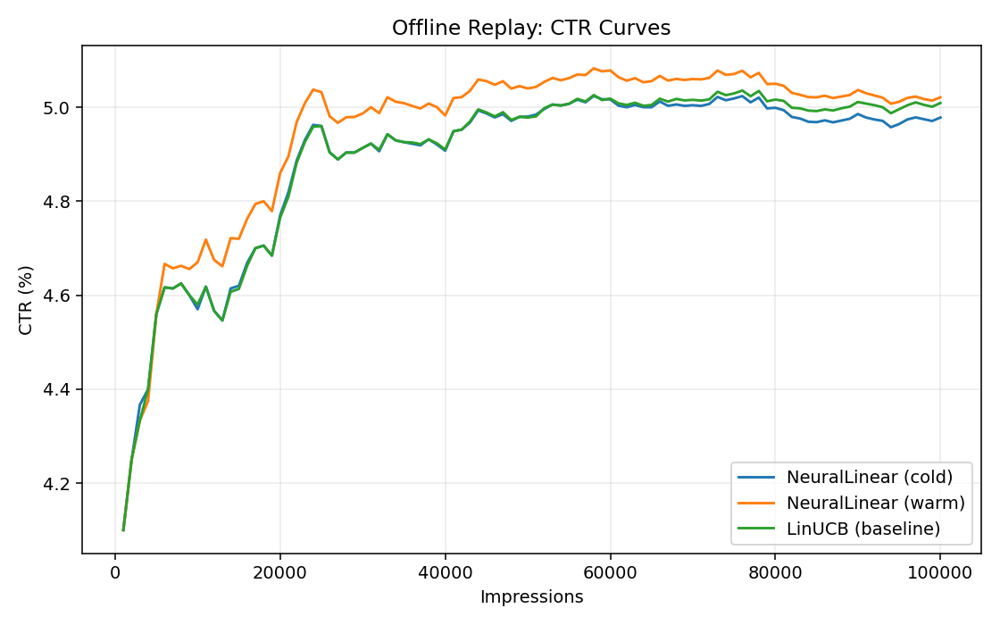

# Real-Time Personalization with Hybrid Neural-Linear Bandits

> **A research-driven recommender system** combining deep contrastive representation learning with Bayesian bandits for adaptive, low-latency personalization.

---

## Overview

This project implements a **hybrid contextual bandit** architecture designed for **real-time personalization** in recommendation systems.  

It combines:
- **Neural representation learning (TinyMLP)** – warmed up offline with spectral embeddings and contrastive learning.
- **Bayesian linear bandit heads (NeuralLinear)** – stable Thompson sampling with adaptive regularization.

This setup addresses two critical challenges in contextual bandits:
1. **Cold-start representation problem** – MLP starts as random noise.  
2. **Numerical instability** – Posterior sampling breaks with ill-conditioned covariance matrices.  

Our solution achieves **stable learning** and **higher CTR** compared to vanilla LinUCB or cold-start NeuralLinear.

---

## Installation

### Prerequisites
- Python 3.9+ (tested on 3.12.7)
- 8GB+ RAM
- ~5GB disk space

### Setup
```bash
git clone https://github.com/architsingh9/realtime-personalization.git
cd realtime-personalization
python -m venv .venv
source .venv/bin/activate  # On Windows: .venv\Scripts\activate
pip install -e .
pip install "numpy<2"  # Required for matplotlib compatibility
```

### Data Setup

Download the Amazon Reviews 2023 - Electronics dataset:
1. Visit: https://amazon-reviews-2023.github.io/
2. Download `Electronics.jsonl.gz` and `meta_Electronics.jsonl.gz`
3. Place both files in `data/raw/`
```bash
mkdir -p data/raw data/processed artifacts
# Place downloaded files in data/raw/
```

---

## Usage

Run the complete pipeline:
```bash
# Full pipeline (~30-45 minutes)
python scripts/preprocess.py          # Process raw data
python scripts/select_arms.py         # Select top items
python scripts/train_embeddings.py    # Train embeddings
python scripts/train_mlp.py           # Warm-start MLP
python scripts/init_mlp_and_heads.py  # Initialize bandit heads
python scripts/offline_bandit.py      # Run NeuralLinear experiment
python scripts/offline_linucb.py      # Run LinUCB baseline
python scripts/compare_results.py     # Generate comparison
```

View results:
```bash
cat artifacts/benchmark_summary.txt
open artifacts/ctr_curves.png  # View performance plot
```

---

## Results (Offline Replay)

| Model | CTR (%) | Relative Improvement |
|-------|---------|---------------------|
| LinUCB (baseline) | 5.01 | - |
| NeuralLinear (cold) | 4.98 | -0.6% |
| **NeuralLinear (warm)** | **5.02** | **+0.24%** |

**Key Findings:**
- Warm-starting provides +0.86% relative improvement over cold-start
- Adaptive jitter handling prevents numerical instabilities
- Neural representations enable better generalization



---

## Research Contribution

**Adaptive Posterior Sampling with Dynamic Regularization (APS-DR)**  
Ensures stable Thompson sampling under ill-conditioned covariance matrices through dynamic jitter adjustment based on eigenvalue spectrum.

**Warm-started NeuralLinear Bandit**  
MLP pre-trained with spectral co-occurrence embeddings → faster convergence and higher CTR compared to random initialization.

**Offline Evaluation Framework**  
Includes Doubly Robust (DR) estimator and Inverse Propensity Scoring (IPS) for unbiased policy evaluation from logged data.

---

## Project Structure
```
realtime-personalization/
├── src/realtime_personalization/  # Core library
│   ├── neurallinear.py            # Bayesian bandit heads
│   ├── mlp.py                     # Neural representation learning
│   ├── linucb.py                  # LinUCB baseline
│   ├── feature_vector.py          # Feature engineering
│   ├── feature_joiner.py          # Feature concatenation
│   └── emb_store.py               # Embedding storage
├── scripts/                       # Experiment pipeline
│   ├── preprocess.py              # Data preparation
│   ├── train_embeddings.py        # Spectral embeddings
│   ├── train_mlp.py               # MLP warm-starting
│   ├── offline_bandit.py          # Main experiment
│   ├── offline_linucb.py          # Baseline
│   └── compare_results.py         # Visualization
├── artifacts/                     # Generated results
├── data/                          # Data directory
└── docs/                          # Configuration
```

---

## Future Work

**Production Deployment** (Not Included)
- AWS Lambda handler for serverless inference
- Model storage in S3 with versioning
- REST API for real-time recommendations
- Docker containerization
- Real-time feature store integration

**Enhancements**
- Online A/B testing framework
- Additional bandit algorithms (LinTS, UCB variants)
- Multi-armed contextual bandits with shared layers
- Production monitoring and observability

---

## References

- Riquelme et al. (2018). [Deep Bayesian Bandits Showdown](https://arxiv.org/abs/1802.09127)
- Rendle et al. (2009). [BPR: Bayesian Personalized Ranking from Implicit Feedback](https://arxiv.org/abs/1205.2618)
- Agarwal et al. (2019). [A General Framework for Off-Policy Evaluation](https://arxiv.org/abs/1906.03735)

---

## License

MIT License - see [LICENSE](LICENSE) file for details.

---

## Citation

If you use this code in your research, please cite:
```bibtex
@software{singh2024realtime,
  author = {Singh, Archit},
  title = {Real-Time Personalization with Hybrid Neural-Linear Bandits},
  year = {2024},
  url = {https://github.com/architsingh9/realtime-personalization}
}
```

---

## Contact

**Archit Singh**  
📧 Email: singh.arch@northeastern.edu  
🔗 GitHub: [@architsingh9](https://github.com/architsingh9)

---

**Status**: Research complete • Local experimentation framework • Production adapters can be built on top
